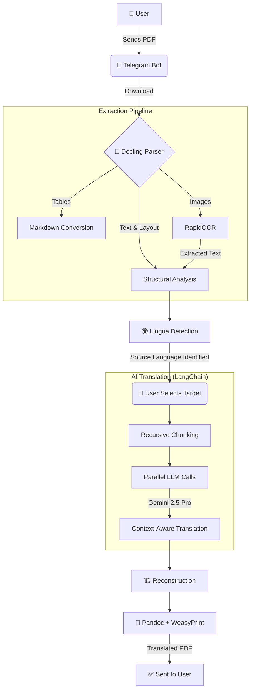

# 📄 PDF Translator AI Bot

<p align="center">
  
  
  
  
  
</p>

A production-grade Telegram bot that receives PDFs, automatically detects the source language, and returns a fully translated version while **preserving document structure, tables, and images**.

---

## 🔄 System Workflow



---

## 🚀 Key Features

- **High Fidelity:** Preserves the original layout, including complex tables and nested structures.
- **Smart OCR:** Automatically extracts text from images within the PDF using RapidOCR.
- **Auto-Detection:** Lingua identifies the source language instantly.
- **Async Power:** Built with `asyncio` for high-concurrency translation using Gemini 2.5 Pro.
- **Markdown-Centric:** Uses Markdown as an intermediate format for precise LLM processing.

---

## 🛠️ Tech Stack

| Layer | Technology |
| :--- | :--- |
| **Interface** | `FastAPI` + `Aiogram v3` |
| **AI Orchestration** | `LangChain` (LCEL) |
| **Language Model** | `Gemini 2.5 Pro` (via OpenRouter) |
| **PDF Intelligence** | `Docling` (Deep Search) |
| **OCR Engine** | `RapidOCR` (ONNX Runtime) |
| **Rendering** | `Pandoc` + `WeasyPrint` |

---

## 📂 Project Structure

```text
pdf_translator/
├── .env.example         # Configuration template
├── README.md            # You are here
├── storage/             # Temp file processing
└── app/
    ├── extractor/       # Standalone extraction tools
    └── bot_translator/  # Core Telegram Bot logic
        ├── app/
        │   ├── bot/     # FSM & Handlers
        │   ├── services/# Business Logic (OCR, PDF, AI)
        │   └── langchain/# Translation chains
        └── tests/       # Quality assurance
```

---

## ⚙️ Installation & Setup

### 1. System Dependencies
You need **Pandoc** and **WeasyPrint** libraries installed on your OS:

```bash
# Ubuntu/Debian
sudo apt-get install pandoc libpango-1.0-0 libpangocairo-1.0-0 libgdk-pixbuf2.0-0

# macOS
brew install pandoc weasyprint
```

### 2. Python Environment
```bash
python -m venv venv
source venv/bin/activate
cd app/bot_translator
pip install -r requirements.txt
```

### 3. Configuration
Copy the template and fill in your API keys:
```bash
cp .env.example .env
```

---

## 📖 Usage

### Running the Bot
```bash
uvicorn app.main:app --host 0.0.0.0 --port 8000 --reload
```

### Bot Commands
- `/start`: Initialize interaction and see instructions.
- `/cancel`: Reset current translation state.

---

## 🧪 Development

Run the test suite to ensure everything is working correctly:
```bash
pytest tests/ -v
```

---

## 📄 License
Distributed under the **MIT License**. See `LICENSE` for more information.

